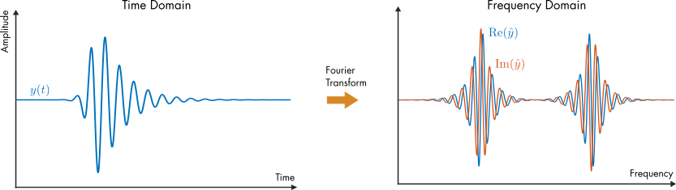
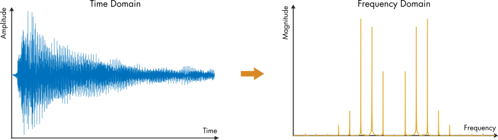

# Fourier Analysis 
 or 

**Curriculum Module**  
_Created with R2021b. Compatible with R2021b and later releases._  

## Description ##
This curriculum module teaches Fourier analysis using interactive [live scripts](https://www.mathworks.com/products/matlab/live-editor.html) and [MATLAB® apps](https://www.mathworks.com/products/matlab/app-designer.html). The module is taught from a signal processing perspective at a level suitable for an introductory signals and systems course. In the first lesson, students use apps to visualize Fourier series and build intuition about the frequency domain. In subsequent lessons, students study complex Fourier series, Fourier transforms, and discrete Fourier transforms. As students progress, they transition from utilizing apps to writing their own code to analyze signals. Throughout the module, students apply Fourier techniques to analyze recorded audio signals.

Each topic includes a lab that applies the concepts taught in the lesson. The solutions are available upon instructor request. If you would like to request solutions or have a question, contact the <a href="mailto:onlineteaching@mathworks.com">MathWorks online teaching team.</a>

Get started with the Fourier Analysis curriculum module by downloading and unzipping the repository. Then, double-click the project .prj file inside MATLAB. From there, you can follow the landing page instructions to get started with the examples and labs.

## Details ##

<table style="vertical-align:top">
  <tr>
    <th>Module</th>
    <th>Learning Goals</th>
  </tr>
  <tr>
    <td>
        <b>1. Fourier Series</b>  
        
    </td>
    <td>    
        <ul>
          <li>Compare signals in the time and frequency domains.</li>
          <li>Analyze audio signals in the frequency domain.</li>
          <li>Visualize Fourier series modes.</li>
          <li>Describe how phase shift is represented in a Fourier series.</li>
          <li>Discuss magnitude and phase.</li>
        </ul>
    </td>
  </tr>
  <tr>
    <td>
        <b>2. Complex Fourier Series</b>  
        
    </td>
    <td>    
        <ul>
          <li>Recall Euler's formula.</li>
          <li>Compare complex and real Fourier series.</li>
          <li>Visualize complex Fourier series.</li>
          <li>Construct functions using complex Fourier series.</li>
        </ul>
    </td>
  </tr>
  <tr>
    <td>
        <b>3. Fourier Transform</b>  
        
    </td>
    <td>    
        <ul>
          <li>Compare Fourier series to the Fourier transform.</li>
          <li>Evaluate the Fourier transform of a function.</li>
          <li>Represent signals using continuous functions.</li>
          <li>Discuss carrier waves and modulation.</li>
          <li>Compare functions in the time and frequency domains using the Fourier transform.</li>
        </ul>
    </td>
  </tr>
  <tr>
    <td>
        <b>4. Discrete Fourier Transform</b>  
        
    </td>
    <td>    
        <ul>
          <li>Plot the discrete Fourier transform (DFT).</li>
          <li>Use the fft function to compute the DFT.</li>
          <li>Relate the DFT to the Fourier transform.</li>
          <li>Apply the DFT to analyze an audio signal.</li>
        </ul>
    </td>
  </tr>
</table>

## Apps ##
<table border=1 style="margin-left:20px; cellpadding:15px;">
  <tr>
    <td style="Horizontal-alignment:center;">
        Sine and Cosine Series
         
        
    </td>
    <td style="Horizontal-alignment:center;">
        Fourier Series
         
        
    </td>
  </tr>
  <tr>
    <td style="Horizontal-alignment:center;">
        Magnitude and Phase
         
        
    </td>
    <td style="Horizontal-alignment:center;">
        Complex Fourier Series
         
        
    </td>
  </tr>
</table>

## Suggested Prework ##
[MATLAB Onramp](https://www.mathworks.com/learn/tutorials/matlab-onramp.html) – a free two-hour introductory tutorial that teaches the essentials of MATLAB.

## Products ##
MATLAB, Symbolic Math Toolbox&trade;

## License ##
The license for this module is available in the [LICENSE.md](license.md) file in this GitHub repository.

## Educator Resources ##
* [Featured Courseware](https://www.mathworks.com/academia/courseware/course-materials.html)
* [Teach with MATLAB and Simulink](https://www.mathworks.com/academia/educators.html)
* [MATLAB Grader](https://www.mathworks.com/products/matlab-grader.html)

# #

_Copyright 2022 The MathWorks, Inc._
