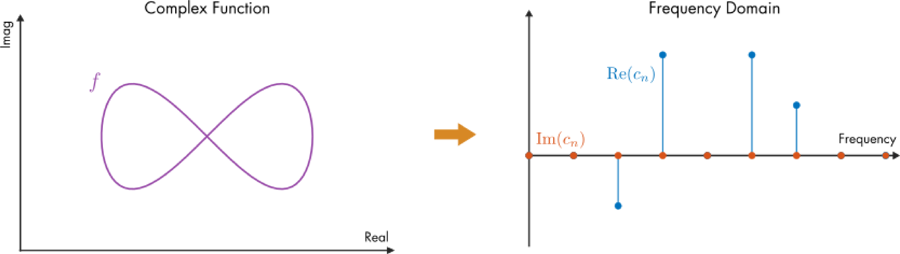

# Fourier Analysis

 or 

**Curriculum Module**

_Created with R2021b. Compatible with R2021b and later releases._

# Information

This curriculum module contains interactive [MATLAB® live scripts](https://www.mathworks.com/products/matlab/live-editor.html) and [MATLAB® apps](https://www.mathworks.com/products/matlab/app-designer.html)  that teaches fundamental concepts of fourier analysis.

## Background

The module is taught from a signal processing perspective at a level suitable for an introductory signals and systems course. In the first lesson, students use apps to visualize Fourier series and build intuition about the frequency domain. In subsequent lessons, students study complex Fourier series, Fourier transforms, and discrete Fourier transforms. As students progress, they transition from utilizing apps to writing their own code to analyze signals. Throughout the module, students apply Fourier techniques to analyze recorded audio signals.

The instructions inside the live scripts will guide you through the exercises and activities. Get started with each live script by running it one section at a time. To stop running the script or a section midway (for example, when an animation is in progress), use the  Stop button in the **RUN** section of the **Live Editor** tab in the MATLAB Toolstrip.

## Contact Us

Solutions are available upon instructor request. Contact the [MathWorks teaching resources team](mailto:onlineteaching@mathworks.com) if you would like to request solutions, provide feedback, or if you have a question.

## Prerequisites

This module assumes minimal MATLAB knowledge required for these scripts, but you could use [MATLAB Onramp](https://matlabacademy.mathworks.com/details/matlab-onramp/gettingstarted) as a resource to acquire familiarity with live scripts and MATLAB syntax.

## Getting Started
### Accessing the Module
### **On MATLAB Online:**

Use the  link to download the module. You will be prompted to log in or create a MathWorks account. The project will be loaded, and you will see an app with several navigation options to get you started.

### **On Desktop:**

Download or clone this repository. Open MATLAB, navigate to the folder containing these scripts and double\-click on [PROJECTNAME.prj](matlab: openProject("PROJECTNAME.prj")). It will add the appropriate files to your MATLAB path and open an app that asks you where you would like to start. 

Ensure you have all the required products ([listed below](#H_E850B4FF)) installed. If you need to include a product, add it using the Add\-On Explorer. To install an add\-on, go to the **Home** tab and select   **Add-Ons** > **Get Add-Ons**. 

## Products

MATLAB®, Symbolic Math Toolbox™

# Scripts

 *If you are viewing this in a version of MATLAB prior to R2023b, you can view the learning outcomes for each script* [*here*](https://www.mathworks.com/matlabcentral/fileexchange/106725-fourier-analysis)

## [**FourierSeries.mlx**](https://matlab.mathworks.com/open/github/v1?repo=MathWorks-Teaching-Resources/Fourier-Analysis&project=fourier-analysis.prj&file=FourierSeries.mlx)
|  | **In this script, students will...** | **Lab Assignments**  |
| :-- | :-- | :-- |
|  | -  Compare signals in the time and frequency domains.  -  Analyze audio signals in the frequency domain.  -  Visualize Fourier series modes.  -  Describe how phase shift is represented in a Fourier series.  -  Discuss magnitude and phase. | [Lab1\_FourierSeries.mlx](https://matlab.mathworks.com/open/github/v1?repo=MathWorks-Teaching-Resources/Fourier-Analysis&project=fourier-analysis.prj&file=Lab1_FourierSeries.mlx)  |

## [**ComplexFourierSeries.mlx**](https://matlab.mathworks.com/open/github/v1?repo=MathWorks-Teaching-Resources/Fourier-Analysis&project=fourier-analysis.prj&file=ComplexFourierSeries.mlx)
|  | **In this script, students will...** | **Lab Assignments**  |
| :-- | :-- | :-- |
|  | -  Compare signals in the time and frequency domains.  -  Analyze audio signals in the frequency domain.  -  Visualize Fourier series modes.  -  Describe how phase shift is represented in a Fourier series.  -  Discuss magnitude and phase. | [Lab2\_ComplexFourierSeries.mlx](https://matlab.mathworks.com/open/github/v1?repo=MathWorks-Teaching-Resources/Fourier-Analysis&project=fourier-analysis.prj&file=Lab2_ComplexFourierSeries.mlx)  |

## [**FourierTransform.mlx**](https://matlab.mathworks.com/open/github/v1?repo=MathWorks-Teaching-Resources/Fourier-Analysis&project=fourier-analysis.prj&file=FourierTransform.mlx)
|  | **In this script, students will...** | **Lab Assignments**  |
| :-- | :-- | :-- |
|  | -  Compare signals in the time and frequency domains.  -  Analyze audio signals in the frequency domain.  -  Visualize Fourier series modes.  -  Describe how phase shift is represented in a Fourier series.  -  Discuss magnitude and phase. | [Lab3\_FourierTransform.mlx](https://matlab.mathworks.com/open/github/v1?repo=MathWorks-Teaching-Resources/Fourier-Analysis&project=fourier-analysis.prj&file=Lab3_FourierTransform.mlx)  |

## [**DiscreteFourierTransform.mlx**](https://matlab.mathworks.com/open/github/v1?repo=MathWorks-Teaching-Resources/Fourier-Analysis&project=fourier-analysis.prj&file=DiscreteFourierTransform.mlx)
|  | **In this script, students will...** | **Lab Assignments**  |
| :-- | :-- | :-- |
|  | -  Compare signals in the time and frequency domains.  -  Analyze audio signals in the frequency domain.  -  Visualize Fourier series modes.  -  Describe how phase shift is represented in a Fourier series.  -  Discuss magnitude and phase. | [Lab4\_DFT.mlx](https://matlab.mathworks.com/open/github/v1?repo=MathWorks-Teaching-Resources/Fourier-Analysis&project=fourier-analysis.prj&file=Lab4_DFT.mlx)  |

# Apps
| Sine and Cosine Series app | Fourier Series app | Magnitude and Phase app | Complex Fourier Series app  |
| :-- | :-- | :-- | :-- |
|  |  |  |   |

# Educator Resources
-  [Educator Page](https://www.mathworks.com/academia/educators.html) 

Copyright 2023 The MathWorks™, Inc

